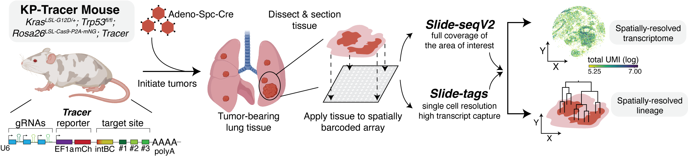

# KPSpatial-release

Code &amp; scripts for reproducing spatial-lineage analyses in [Jones*, Sun* et al.](https://www.biorxiv.org/content/10.1101/2024.10.21.619529v2).

* `./utilities/`: Utilities for handling spatial and phylogenetic data.
* `./reproducibility/`: Notebooks to reproduce each figure panel. Each figure has it's own folder, and associated data and scripts are included.
* `./data/`: General data for project.

To run these notebooks, clone this repository and add the path to your system path to run utilities.
You may find the processed datasets on Zenodo ([10.5281/zenodo.19771805](10.5281/zenodo.19771805))

